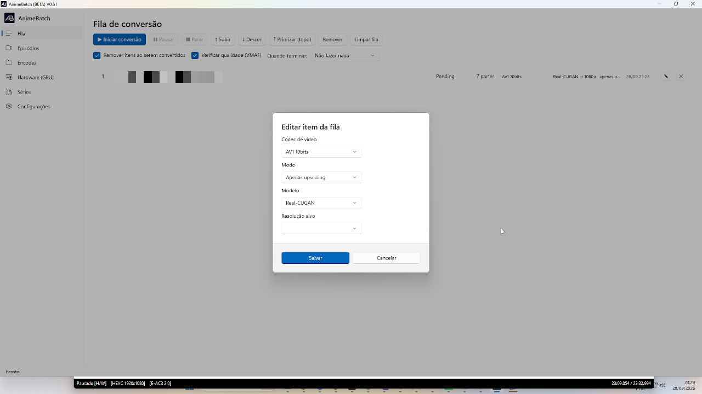

# 2. Fila

*[← Anterior: Instalação](01-instalacao.md) · [Índice](README.md) · [Próxima: Episódios →](03-episodios.md)*

---

A tela **Fila** (Fila de conversão) é onde os episódios enfileirados em
*Episódios* são efetivamente convertidos, na ordem em que aparecem.


## Botões de controle

| Botão | O que faz |
|-------|-----------|
| **▶ Iniciar conversão** | Começa a processar a fila a partir do primeiro item pendente |
| **❚❚ Pausar** | Congela o job atual; retomar com *Iniciar* de novo |
| **■ Parar** | Interrompe o job atual (as partes já prontas continuam no disco e são reaproveitadas) |
| **↑ Subir / ↓ Descer** | Move o item selecionado uma posição |
| **⤒ Priorizar (topo)** | Joga o item selecionado para a primeira posição |
| **Remover** | Tira o(s) item(ns) selecionado(s) da fila |
| **Limpar fila** | Remove todos os itens de uma vez — o job em execução **não** é tocado |

Reordenação só vale para itens **Pendentes** ou **Pausados**: o item que está
sendo convertido (ou já concluído/com erro) não muda de lugar.

## Opções da linha inferior


- **Remover itens ao serem convertidos** — concluído o episódio, ele sai da
  lista sozinho (o histórico permanece na série e no banco).
- **Verificar qualidade (VMAF)** — ao fim de cada parte, o app decodifica
  fonte × resultado e grava a nota VMAF daquela parte — uma análise **quadro
  a quadro**. É uma verificação a posteriori: não altera o encode, só mede —
  ao custo de **aumentar bastante o tempo de conversão** (a estimativa de
  *Falta* no rodapé já inclui esse tempo). A nota orienta o ajuste fino dos
  bitrates por capítulo/classe na série.
- **Quando terminar:** o que fazer quando a **fila inteira** acabar:
  *Não fazer nada*, *Desligar o computador*, *Hibernar*, *Modo espera*,
  *Logoff*, *Bloquear sistema* ou *Sair do AnimeBatch*.

## Os itens da fila

Cada linha mostra: **posição · nome do arquivo · status · N partes · codec ·
modelo/resolução de upscaling (se houver) · data do enfileiramento · ✏ editar ·
✖ remover**.




O lápis (**✏**) abre o **Editar item da fila**, que permite mudar naquele item,
sem re-enfileirar: **Codec de vídeo**, **Modo** (upscaling), **Modelo** e
**Resolução alvo**. As partes ainda não convertidas passam a usar a nova
configuração. A edição (e a reordenação) fica **indisponível enquanto a fila
está processando**.

## Lendo o rodapé de progresso

Durante a conversão, o rodapé da janela vira um painel de status em tempo real:

```
{arquivo} · 1/7 · Episódio · passo 2/2 · Alvo: 450 kbps · FPS: 98.8 ·
Velocidade: 3.4x · Decorrido: 00:24 · Falta: 00:23 · Vídeo convertido: 0.9 min
```


Campo a campo:

- **1/7** — você está na parte 1 de 7 do job (uma parte = um capítulo).
- **Episódio / Opening / Encing...** — o capítulo (parte) atual.
- **passo 2/2** — em encodes de 2 passadas, só a **passada 2** produz vídeo;
  na 1 o rodapé também mostra `passo 1/2`. No motor AV1an não existe essa
  linha — as duas passadas correm **dentro** de cada chunk.
- **Alvo: 450 kbps** — o bitrate daquela parte (do capítulo ou da série).
- **FPS / Velocidade** — quadros por segundo do encode e a razão
  "tempo de vídeo produzido ÷ tempo de relógio" (3.4x = 1 hora de vídeo a cada
  ~17,6 min).
- **Decorrido / Falta** — tempo gasto e estimativa para terminar **aquela
  parte**.
- **Vídeo convertido** — total de vídeo do job já produzido.

**Fases do motor AV1an:** o rodapé também mostra o que o motor está fazendo
antes dos chunks — *analisando cenas* (a análise de corte por cena é de um
núcleo só e pode levar minutos em silêncio), *preparando chunks*,
*segmentando vídeo* (quando não usa BestSource) e *chunk N/M* durante o encode.

**Workers paralelos:** com 2 ou 3 encodes simultâneos configurados na aba
*Encodes*, o rodapé mostra uma linha `▸` por worker com o chunk e o fps de
cada um.

---

*[← Anterior: Instalação](01-instalacao.md) · [Índice](README.md) · [Próxima: Episódios →](03-episodios.md)*
