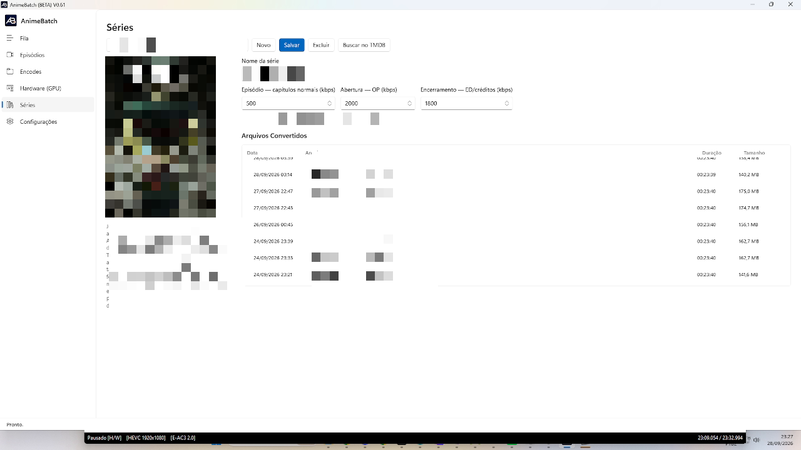
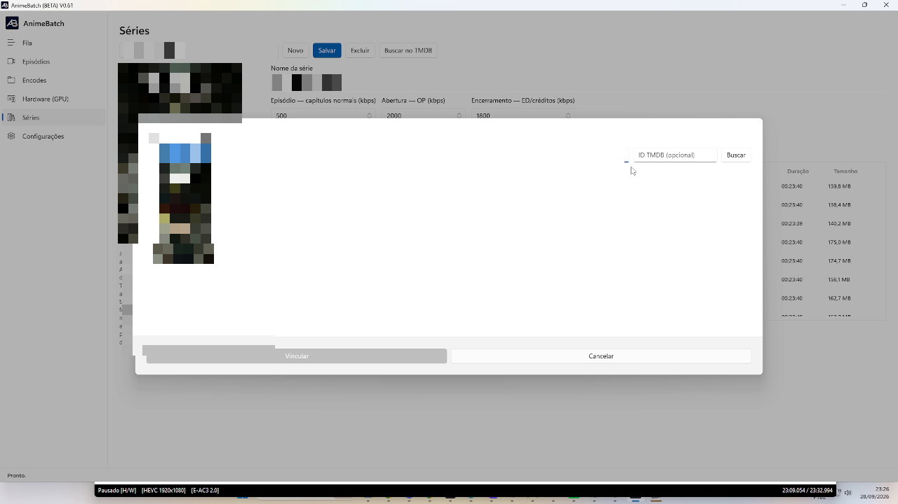

# 6. Séries

*[← Anterior: Hardware](05-hardware.md) · [Índice](README.md) · [Próxima: Configurações →](07-configuracoes.md)*

---

A aba **Séries** é o cadastro que dá "memória" ao app: para cada série você
define os **bitrates padrão por classe de capítulo** e acompanha o histórico
de conversões. Toda série convertida pela tela [Episódios](03-episodios.md)
aparece aqui automaticamente.

## Cadastro e bitrates por classe

No topo ficam o **seletor de séries**, **Novo**, **Salvar**, **Excluir** e
**Buscar no TMDB**; abaixo, o **Nome da série** e os três campos que definem a
estratégia de bitrate da série:

| Campo | O que controla |
|-------|----------------|
| **Episódio — capítulos normais (kbps)** | As partes comuns do episódio (diálogos, cenas normais) |
| **Abertura — OP (kbps)** | A abertura: música + movimento — costuma precisar **bem mais** bits |
| **Encerramento — ED/créditos (kbps)** | O encerramento/créditos |

Na prática do autor: enquanto a série usa 500 kbps para episódios, abertura e
encerramento podem pedir 2000 — **não existe fórmula**: converta, avalie a
qualidade (com ajuda do VMAF da fila) e ajuste. Definido o padrão de uma
série, ele vale para todos os episódios dela; só reavalie se a abertura mudar
ou uma cena de ação exigir um [capítulo temporário](03-episodios.md) próprio.

Quando um `.mkv` tem capítulos com nomes que indicam abertura/encerramento, a
grade já nasce com os valores daqui aplicados.

## Buscar no TMDB

Com a **chave da API do TMDB** configurada (ver
[Configurações](07-configuracoes.md)), o botão **Buscar no TMDB** abre o
modal de vínculo:

- Pesquise pelo **nome da série** ou cole o **ID TMDB (opcional)** direto —
  se o nome é ambíguo, o ID resolve.
- Clique no resultado e depois em **Vincular**: o app baixa **pôster** e
  **sinopse**, que passam a aparecer na aba (guardados no banco, sem cache de
  arquivo).
- O rodapé do cadastro mostra *✓ TMDB vinculado: {nome} (id N)*.

## Arquivos Convertidos (histórico)

A tabela mostra **Data · Arquivo · Duração · Tamanho** de cada episódio
convertido da série. **Nomes repetidos na lista são normais**: cada linha é
uma conversão concluída — re-encode de uma parte com bitrate insuficiente
gera uma linha nova. É assim que você acompanha o tamanho final que está
atingindo por episódio.

---

*[← Anterior: Hardware](05-hardware.md) · [Índice](README.md) · [Próxima: Configurações →](07-configuracoes.md)*
