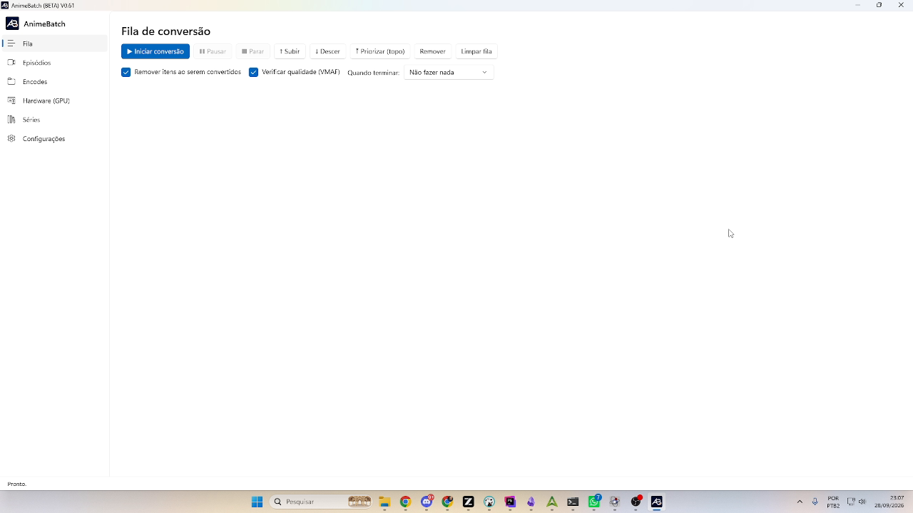
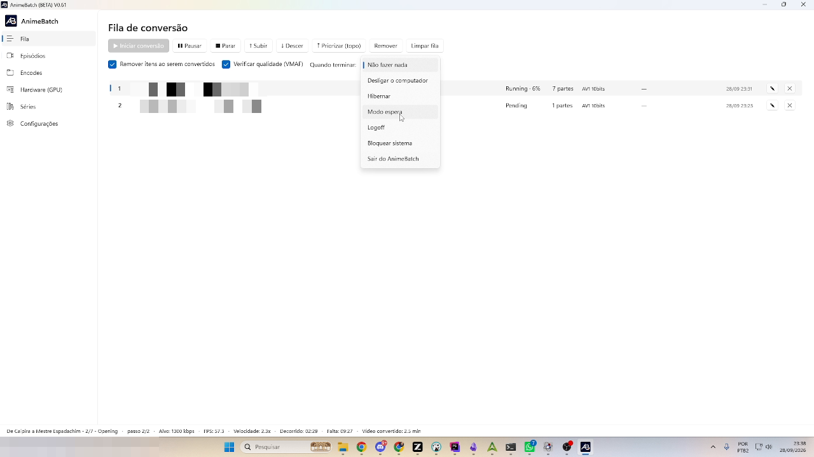
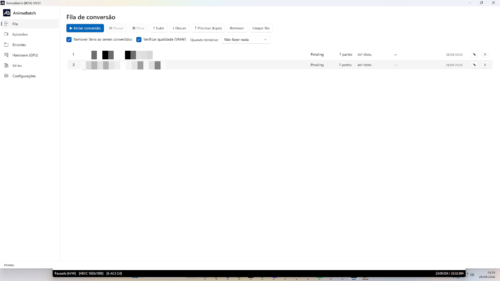
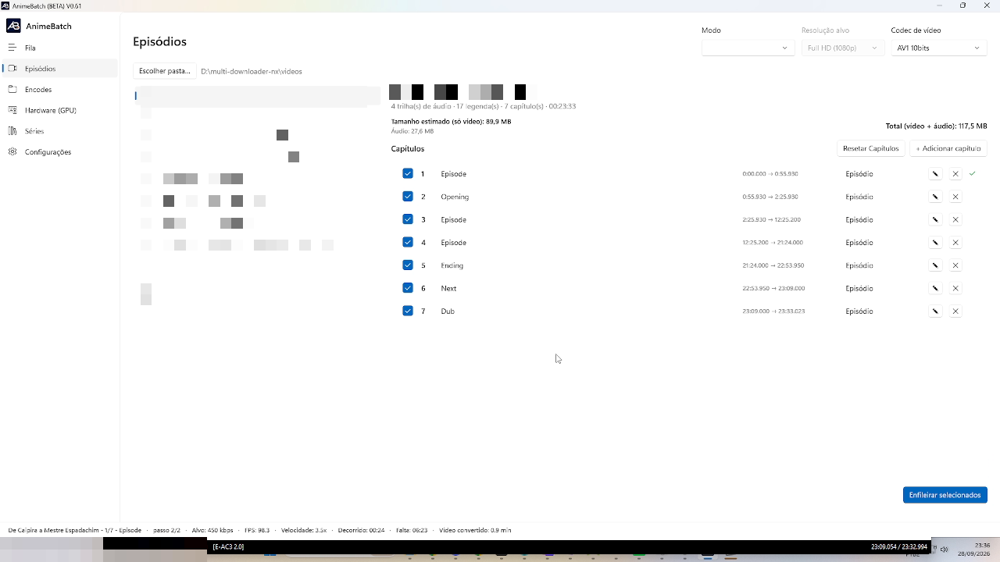

# 2. Queue

*[← Previous: Installation](01-installation-and-concepts.md) · [Index](README.md) · [Next: Episodes →](03-episodes.md)*

---

The **Queue** screen (Conversion queue) is where the episodes enqueued on
*Episodes* are actually converted, in the order they appear.



## Control buttons

| Button | What it does |
|--------|--------------|
| **▶ Start conversion** | Starts processing the queue from the first pending item |
| **❚❚ Pause** | Freezes the current job; resume with *Start* again |
| **■ Stop** | Interrupts the current job (finished parts stay on disk and get reused) |
| **↑ Move up / ↓ Move down** | Moves the selected item one position |
| **⤒ Prioritize (top)** | Sends the selected item to the first position |
| **Remove** | Takes the selected item(s) out of the queue |
| **Clear queue** | Removes every item at once — the running job is **not** touched |

Reordering only applies to **Pending** or **Paused** items: the item being
converted (or already finished/failed) doesn't change position.

## The options row



- **Remove items once converted** — when an episode finishes, it leaves the
  list by itself (the history stays with the series and in the database).
- **Quality check (VMAF)** — at the end of each part, the app decodes source
  × result and records that part's VMAF score — a **frame-by-frame**
  analysis. It's a post-hoc check: it doesn't change the encode, only
  measures it — at the cost of **substantially increasing conversion time**
  (the footer's ETA already includes it). The score guides fine-tuning the
  per-chapter/class bitrates of the series.
- **When done:** what to do when the **whole queue** finishes: *Do nothing*,
  *Shut down the computer*, *Hibernate*, *Sleep*, *Log off*, *Lock system* or
  *Exit AnimeBatch*.

## The queue items

Each row shows: **position · file name · status · N parts · codec ·
upscaling model/resolution (if any) · enqueue date · ✏ edit · ✖ remove**.



The pencil (**✏**) opens **Edit queue item**, which lets you change — on that
item alone, without re-enqueueing: **Video codec**, **Mode** (upscaling),
**Model** and **Target resolution**. Parts not yet converted start using the
new configuration. Editing (and reordering) is **unavailable while the queue
is processing**.

## Reading the progress footer

During conversion, the window footer becomes a live status panel:

```
{file} · 1/7 · Episode · pass 2/2 · Target: 450 kbps · FPS: 98.8 ·
Speed: 3.4x · Elapsed: 00:24 · Remaining: 00:23 · Video converted: 0.9 min
```



Field by field:

- **1/7** — you're on part 1 of 7 of the job (one part = one chapter).
- **Episode / Opening / Ending...** — the current chapter (part).
- **pass 2/2** — on 2-pass encodes, only **pass 2** produces video; on pass 1
  the footer shows `pass 1/2`. The Av1an engine has no such line — both passes
  run **inside** each chunk.
- **Target: 450 kbps** — that part's bitrate (from the chapter or the series).
- **FPS / Speed** — encode frames per second and the ratio of "video produced
  ÷ wall-clock time" (3.4x = 1 hour of video every ~17.6 min).
- **Elapsed / Remaining** — time spent and the estimate to finish **that
  part**.
- **Video converted** — total job video produced so far.

**Av1an engine phases:** the footer also shows what the engine is doing
before the chunks — *analyzing scenes* (the scene-cut analysis is
single-core and can take minutes in silence), *preparing chunks*,
*segmenting video* (when BestSource isn't available) and *chunk N/M* during
the encode.

**Parallel workers:** with 2 or 3 simultaneous encodes configured on the
*Encodes* tab, the footer shows one `▸` line per worker with its chunk and
fps.

---

*[← Previous: Installation](01-installation-and-concepts.md) · [Index](README.md) · [Next: Episodes →](03-episodes.md)*
