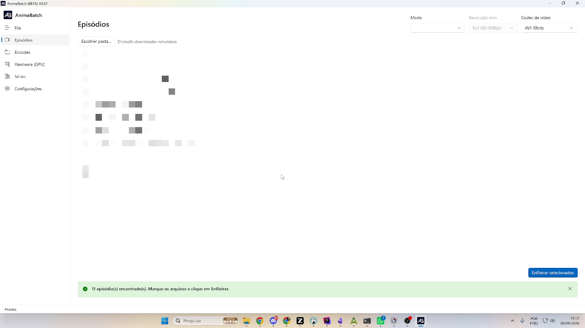
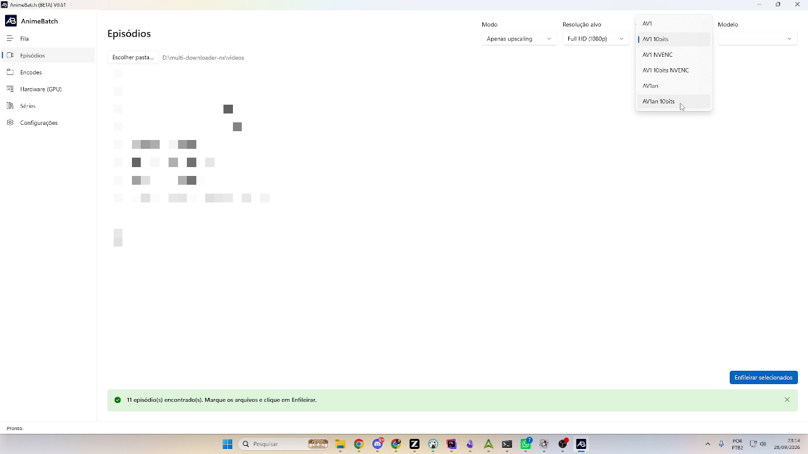
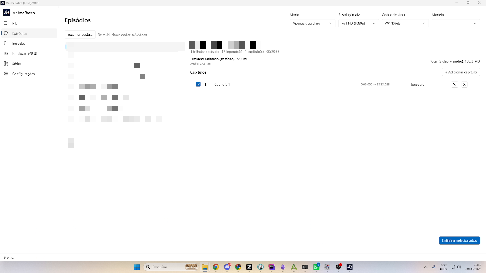
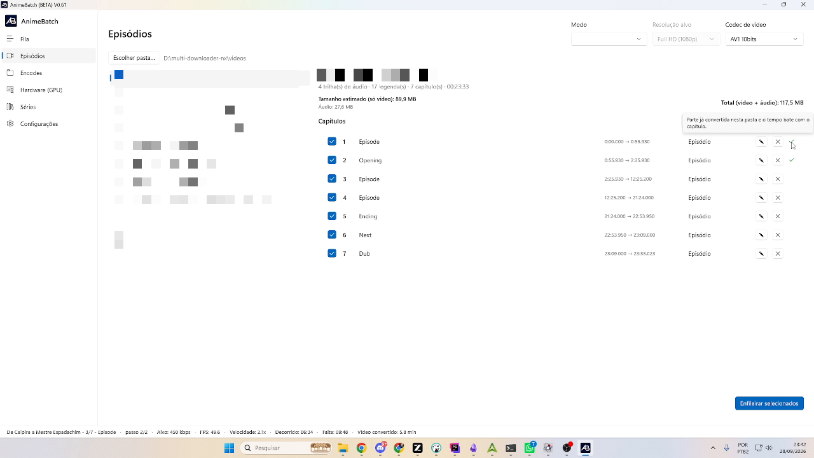
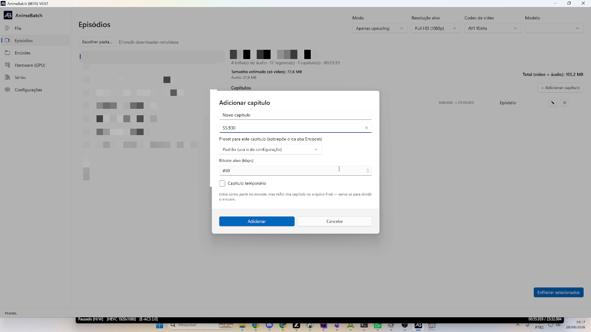

# 3. Episodes

*[← Previous: Queue](02-queue.md) · [Index](README.md) · [Next: Encodes →](04-encodes.md)*

---

The **Episodes** screen is the heart of AnimeBatch: here you pick the files,
decide **how** they'll be converted (codec, upscaling) and **into how many
pieces** (chapter grid), then send them to the queue.

## Choosing the folder

The **Choose folder…** button lists the videos (`.mkv`/`.mp4`) of the selected
folder. If the **Source videos folder** is set in *Settings*, it loads
automatically — and the tab remembers the last folder used. You can switch
folders at any time, even mid-session.

## Mode, resolution, model and codec

At the top right are the four decisions that apply to files enqueued from
here on:

- **Mode** — *No upscaling* (convert only), *Upscaling only* (improve the
  resolution without the AV1 re-encode) or *Upscaling and encode* (both).
- **Model** (when upscaling) — *Real-CUGAN*, *Real-ESRGAN (animevideov3)* or
  *AnimeJaNai (ONNX/DirectML)*.
- **Target resolution** — HD 720p, Full HD 1080p, 2K or 4K. For small sources,
  720p avoids stretching the image too much.
- **Video codec** — the AV1 encode family (see table below).

| Codec | Characteristics |
|-------|-----------------|
| **AV1 / AV1 10bits** (SVT) | Software encoder (CPU), 2-pass. Delivers the **best quality at low bitrates** — the recommended path for episodes |
| **AV1 NVENC / AV1 10bits NVENC** | **NVIDIA GPU** encoder: much faster, but built for streaming — at low bitrates it produces larger files for the same quality. Ideal when time matters more than size |
| **AV1an / AV1an 10bits** | The same SVT, orchestrated by **av1an**: splits the video into scene chunks and encodes several in parallel — SVT quality with **more speed**, at the cost of an initial analysis phase (visible in the footer) |

Each family has its own configuration on the [Encodes](04-encodes.md) tab.

## The selected file panel

Clicking a file in the list shows on the right panel what ffprobe found in it:
the number of **audio tracks**, **subtitles**, **chapters** and the
**duration**; plus the estimated final size under the current bitrates —
**video only**, **audio**, and the **total**.

## The chapter grid

This is where the app's central idea lives: **each chapter becomes an encode
part with its own bitrate**. An episode doesn't need a single bitrate — the
opening has music and movement (it asks for more bits), the episode itself is
mostly dialogue (fewer bits), static "next episode" cards or black dubbing
screens ask for almost nothing. Splitting it this way, the final file ends up
**much smaller** with **higher** quality than a single encode — the same
principle streamings use.

**Where do the chapters come from?** If the `.mkv` already has embedded
chapters, the grid comes filled with them (and names indicating
opening/ending already match the series' default bitrates). If it doesn't, a
single chapter covering the whole video appears, and you create your own. The
edited grid is **saved to disk** (`chapters-edits`, in AppData): closing and
reopening the app doesn't lose your edits, and you can change them whenever
you want.

### Reading the grid

Each row has: a **check box** (which parts to convert), **number**, **name**,
**start → end** (the end is derived: it's the next chapter's start; the last
one ends at the video duration), the **class** (*Episode*, *Opening*,
*Ending*), and the **✏ edit** and **✖ delete** buttons.

The **green ✓** next to the ✖ means: *"Part already converted in this folder
and its timing matches the chapter"* — that part **won't be re-encoded** if
you enqueue again. If the file exists but the timing **no longer** matches
(because you changed the grid), the marker turns red and clicking the ✖
offers to **delete the file** so no stale leftover conflicts with the new
encode.

### Adding / editing a chapter

The dialog asks **only for the start time** (`mm:ss` or `hh:mm:ss` —
milliseconds are accepted, e.g. `0:55.930`); the end is always derived from
the grid. The other fields:

- **Chapter name** — free text (`Opening`, `Episode`...). You can also rename
  chapters that came from the `.mkv` itself.
- **Preset for this chapter** — overrides the Encodes-tab preset (e.g. preset
  4 on the opening: slower but better).
- **Target bitrate (kbps)** — that part's value. Left on the default, it uses
  the class bitrate from the series; if the codec is in Constant Quality
  mode, the field becomes **Quality (CQ)**.
- **Temporary chapter** — enters the encode as a part but **doesn't** become
  a chapter in the final file. Use it to **isolate a scene** (e.g. an action
  scene in the middle of the episode) with high bitrate without polluting the
  chapter list of the final `.mkv`.

**Splitting tips** (from the app author):

- Validation has only two rules: the time must be within the video and **no
  two chapters may start at the same second**. To move the boundary between
  two chapters, edit the chapter **after** the boundary.
- It's worth **splitting the episode in the middle** (e.g. at 12:25): if
  something goes wrong with a part, you re-encode just that part instead of
  the whole episode.
- Intense action scenes that blow past the default bitrate: create a chapter
  (or temporary chapter) just for it and raise the bitrate — 1000, 2000,
  3000 kbps, depending on the scene.

### Insert, delete, reset — and what happens to the files

- **Inserting a chapter in the middle**: the following ones get **renumbered**
  and the already-converted part files are **renamed on disk** to the new
  numbering (the rename happens in two phases, collision-free).
- **Deleting a chapter**: besides removing it from the grid, it **deletes the
  corresponding part file** in the folder (with confirmation) — you changed
  your strategy, so the old file is no longer useful.
- **Reset chapters**: wipes the edited grid and goes back to the `.mkv`
  chapters (or the single chapter, if the file had none); parts left
  **orphaned** in the folder are offered for removal.

### Converting a single chapter

With the grid filled in, uncheck the boxes and leave **only the chapter you
want** checked: just that part gets encoded. Useful for redoing a chapter
whose bitrate came out too low — at the merge, parts with different bitrates
are joined into the final file normally.

## Enqueueing

Check the files and click **Enqueue selected** (bottom right). Details:

- The green banner shows how many episodes were found in the folder.
- Enqueueing an episode **already in the queue updates the existing item**
  (no duplicates) — that's how you apply new default bitrates to a pending
  job.
- If the file's series isn't registered yet, the warning *"⚠ Series not
  registered — will be registered with defaults when enqueued"* appears;
  register it on [Series](06-series.md) to control the bitrates.
- Already-converted, still-valid parts are **reused at the merge without
  re-encoding** (the confirmation message shows how many).

---

*[← Previous: Queue](02-queue.md) · [Index](README.md) · [Next: Encodes →](04-encodes.md)*
