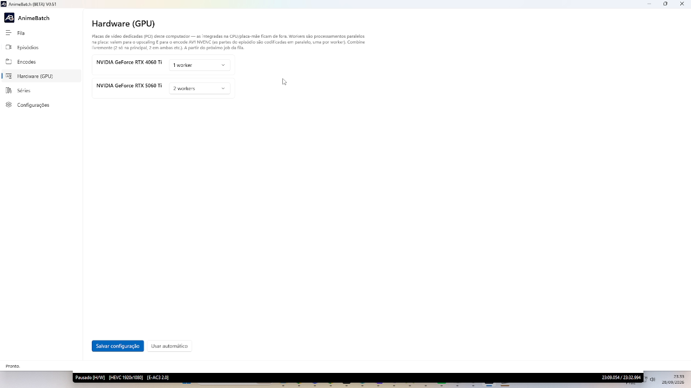

# 5. Hardware (GPU)

*[← Previous: Encodes](04-encodes.md) · [Index](README.md) · [Next: Series →](06-series.md)*

---

The **Hardware (GPU)** tab lists the **dedicated video boards** (PCI) in the
computer — CPU-integrated ones are left out — and lets you set **how many
workers** each one should use.

## What a worker is

A worker = one **parallel processing unit on the board**. Workers apply to:

- **upscaling** (Real-CUGAN, Real-ESRGAN, AnimeJaNai) — each worker processes
  a stretch of the video in parallel; and
- the **AV1 NVENC encode** — episode parts are encoded in parallel, one per
  worker.

You can combine freely (2 only on the main board, 2 on both, etc.) and even
set **0 workers — don't use this board**.

## Automatic vs manual

- **Use automatic** — the app detects the NVIDIA boards, gives one worker to
  each and an extra to the main one. Good enough for almost everyone.
- **Save configuration** — locks the manual per-board choice. Changes take
  effect **starting with the next job in the queue** (the running job isn't
  touched).

When configured here, this setting **takes precedence** over the *Upscaling
GPUs* field in [Settings](07-settings.md).

## Real-world numbers (author's machine)

With an RTX 5060 Ti dedicated to the app and the RTX 4060 Ti handling the
desktop (1 worker):

| Upscaling configuration | Speed |
|-------------------------|-------|
| 1 worker on the 5060 Ti | ~15 fps |
| 2 workers on the 5060 Ti | ~28 fps |
| Two boards (2 + 1 workers) | ~36 fps |

For reference: an anime episode runs at 23.976 fps — above that, upscaling
runs **faster than real time** (a season in hours, not days).

---

*[← Previous: Encodes](04-encodes.md) · [Index](README.md) · [Next: Series →](06-series.md)*
