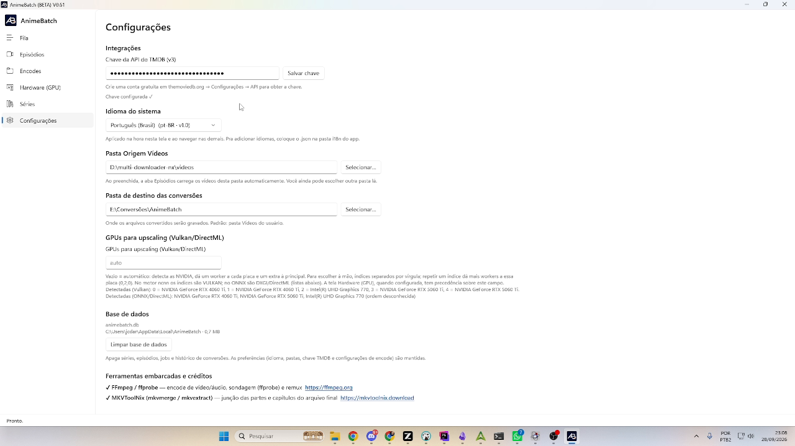
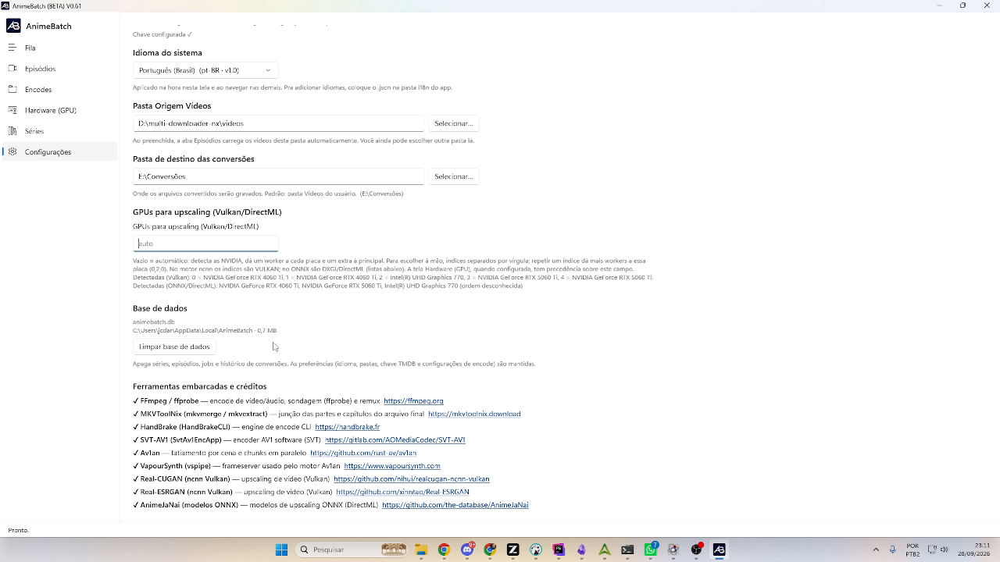

# 7. Settings

*[← Previous: Series](06-series.md) · [Index](README.md)*

---

The **Settings** tab concentrates the app's global preferences — configure
here once and the rest of the usage flows.

## Integrations — TMDB key

The **TMDB API key (v3)** enables series search, posters and synopses on the
[Series](06-series.md) screen. Create a free account at
[themoviedb.org](https://www.themoviedb.org/) → *Settings → API*, paste the
key and click **Save key**. Without a key those features stay off (the rest
of the app works normally).

## System language

*Português (Brasil)* or *English* — applied immediately. To add a new
language, just drop a `.json` file into the app's `i18n\` folder.

## Folders

- **Source videos folder** — where the [Episodes](03-episodes.md) tab loads
  videos from automatically when opened (you can still change the folder
  there, and the last one used is remembered).
- **Conversion output folder** — where results are written: **final files**
  at the folder's root and **intermediate parts** in
  `output\AnimeBatch\{episode}\` (see
  [Installation and concepts](01-installation-and-concepts.md)).

## Upscaling GPUs (Vulkan/DirectML)

Leaving it **empty (`auto`)**, the app detects the NVIDIA boards and
distributes workers automatically. To choose manually, provide comma-separated
**indices** (repeating an index gives that board more workers, e.g. `0,2,0`).
On the ncnn engine the indices are Vulkan; on ONNX they're DXGI/DirectML —
the *Detected* list under the field shows what exists on the machine. When
the [Hardware (GPU)](05-hardware.md) tab is configured, **it takes
precedence** over this field.

## Automatic calibration

Automatic calibration **analyzes the video** (a single-pass reference encode)
and **measures how much bitrate each scene really consumes** — from Very Low
to Very High — to split the episode into blocks by criticality and give each
block its level's bitrate. Here you set the **total kbps of each level**
(Very Low, Low, Normal, High, Very High) and click **Save**. Until all five
values are saved, the calibrate button on the
[Episodes](03-episodes.md) screen stays blocked. Starting points: 300 / 600 /
1000 / 1600 / 2400 kbps.

## Database

Shows where the database lives (`%LOCALAPPDATA%\AnimeBatch\animebatch.db`)
and its current size. The **Clear database** button wipes series, episodes,
queue and conversion history — **keeping preferences** (language, folders,
TMDB key and encode settings). The action asks for confirmation and is
blocked while the queue is running. Edited chapter grids
(`chapters-edits\`, next to the database) also live in AppData and survive
reinstalls.

## Bundled tools and credits

The final list shows each tool bundled with the package and its role — names
are links to the original projects:

| Tool | Role |
|------|------|
| **FFmpeg / ffprobe** | video/audio encode, probing and remux |
| **MKVToolNix** (mkvmerge/mkvextract) | merging parts and chapters into the final file |
| **HandBrake (HandBrakeCLI)** | CLI encode engine |
| **SVT-AV1 (SvtAv1EncApp)** | software AV1 encoder (SVT) |
| **Av1an** | scene slicing and parallel chunks |
| **VapourSynth** | frameserver used by the Av1an engine |
| **Real-CUGAN** (ncnn Vulkan) | video upscaling |
| **Real-ESRGAN** (ncnn Vulkan) | video upscaling |
| **AnimeJaNai** (ONNX models) | ONNX upscaling (DirectML) |

---

*[← Index](README.md)*
