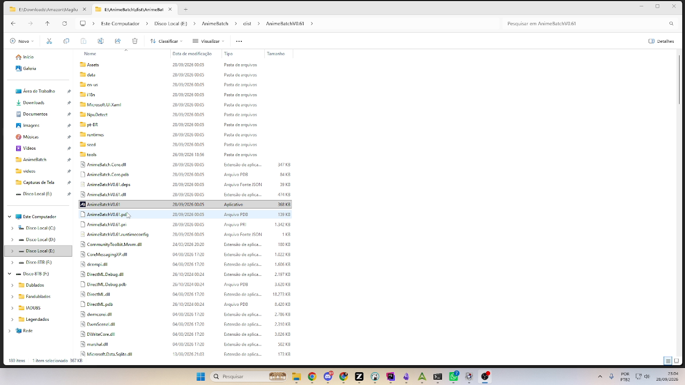

# 1. Instalação e conceitos

*[← Índice](README.md) · [Próxima: Fila →](02-fila.md)*

---

O AnimeBatch é um projeto **open source** para quem gosta de converter vídeos
— em especial **séries de animes**, embora sirva para qualquer vídeo. A ideia
central: converter cada vídeo **em capítulos separados**, escolhendo para cada
capítulo o **bitrate suficiente para aquela cena** — mais bits na abertura e
nas cenas rápidas, menos nas estáticas. O resultado é um arquivo pequeno com
qualidade muito superior à de um encode único de bitrate médio (o mesmo
método que streamings como a Netflix usam). O app é escrito em .NET
(WinUI 3) e roda exclusivamente no Windows, focado no codec **AV1** pela
eficiência em animes — com três motores (SVT, NVENC e Av1an), cada um em 8 ou
10 bits, além dos modelos de upscaling.

## O pacote portátil

O AnimeBatch é distribuído como **pacote portátil**: não há instalador — a
pasta baixada já é o programa completo. Basta descompactar em qualquer pasta do
disco (por exemplo `F:\AnimeBatch\V0.61`) e executar o
`AnimeBatchV0.61.exe` (o número muda conforme a versão).

Dentro da pasta você encontra, entre vários arquivos de sistema:

| Item | Para que serve |
|------|----------------|
| `AnimeBatchV0.61.exe` | O executável principal (o número de versão faz parte do nome de propósito — não renomeie o `.exe`, os arquivos `.deps` e `.runtimeconfig` ao lado casam com esse nome) |
| `data\` | Contém um `animebatch.db` **semente** — serve de modelo para o banco verdadeiro na primeira execução |
| `tools\` | As ferramentas externas que o app usa (ffmpeg, ffprobe, mkvmerge, SVT-AV1, HandBrakeCLI, av1an etc.) — **sem ela a conversão não funciona** |
| `i18n\` | Os idiomas disponíveis (arquivos `.json`; adicionar um idioma = adicionar um `.json` aí) |
| `runtimes\`, `rsrc\`, `NpuDetect\`, DLLs `Microsoft.*`/`DirectML*` | Runtime do WinUI 3, DirectML e recursos internos — não mexa |

> **Importante:** para atualizar de versão, descompacte a pasta nova ao lado e
> copie o `data\animebatch.db` da pasta antiga para a nova **antes do primeiro
> uso** (ou continue usando o banco antigo — veja abaixo onde ele mora). Na
> primeira execução da versão nova, o banco semente é copiado para o
> AppData **apenas se lá não existir banco ainda** — o banco do AppData nunca é
> sobrescrito pelo pacote.

## Onde ficam os seus dados (sobrevivem a reinstalação)

Tudo que você cadastra mora **fora** da pasta do programa, no perfil do
usuário:

- **Banco de dados**: `%LOCALAPPDATA%\AnimeBatch\animebatch.db`
  (séries, episódios, fila, histórico, configurações de encode e preferências).
  A tela *Configurações* mostra o caminho e o tamanho atual.
- **Grades de capítulos editadas**: `%LOCALAPPDATA%\AnimeBatch\chapters-edits\`
  — um `.json` por episódio editado. É o que faz a sua edição de capítulos
  "vencer" os capítulos gravados dentro do vídeo quando você reabre o arquivo.

Apagar a pasta do programa **não** apaga esses dados; para zerar tudo de
dentro do app, use *Configurações → Base de dados → Limpar base de dados*.

## Para onde vão os arquivos convertidos

Dois destinos distintos, derivados da **Pasta de destino das conversões**
(configurável em *Configurações*):

- **Arquivo final** (o episódio convertido completo): na **raiz** da pasta de
  destino.
- **Partes intermediárias**: em `destino\AnimeBatch\{nome do episódio}\` — uma
  por capítulo da grade, com nome no formato
  `NN - {capítulo} - {arquivo}.mkv` (ex.: `02 - Opening - S02E09.mkv`).
  Essas partes são o que permite **reaproveitar conversões** (ver
  [Episódios](03-episodios.md)).

## Vocabulário do app

- **Job** — um episódio na fila de conversão. Aparece na tela *Fila* com
  status `Pending`, `Running`, `Done` ou erro.
- **Parte** — um pedaço do job, correspondendo a **um capítulo** da grade
  (ou ao episódio inteiro, se ele só tiver o capítulo padrão). Cada parte é
  encodeada separadamente e todas são juntadas no final com capítulos.
- **Capítulo** — uma divisão do episódio definida por um **tempo inicial**
  (o fim é sempre o início do próximo capítulo; o fim do último é a duração do
  vídeo). A grade de capítulos define quantas partes o encode terá.
- **Classe do capítulo** — *Episódio*, *Abertura* (OP) ou *Encerramento*
  (ED/créditos). A classe define **qual bitrate da série** será usado naquela
  parte (ver [Séries](06-series.md)).
- **Upscaling** — aumentar a resolução com rede neural (modelos Real-CUGAN,
  Real-ESRGAN ou AnimeJaNai) usando a GPU, antes ou junto do encode.
- **VMAF** — métrica de qualidade que compara o arquivo convertido com a fonte
  (0–100; quanto maior, mais fiel). A fila pode calculá-la ao final de cada
  parte quando *Verificar qualidade (VMAF)* está marcado.

---

*[← Índice](README.md) · [Próxima: Fila →](02-fila.md)*
