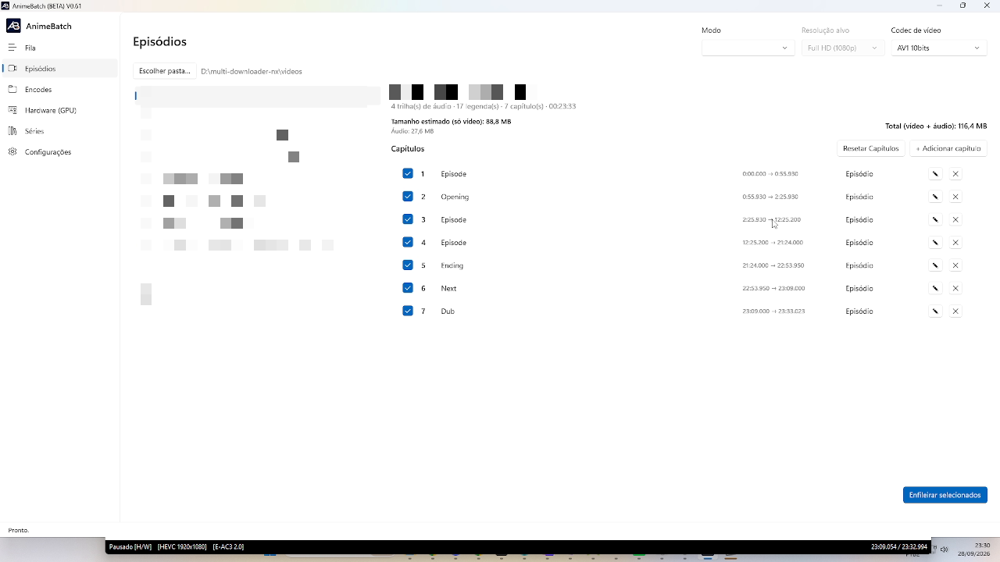

# 3. Episódios

*[← Anterior: Fila](02-fila.md) · [Índice](README.md) · [Próxima: Encodes →](04-encodes.md)*

---

A tela **Episódios** é o coração do AnimeBatch: é nela que você escolhe os
arquivos, define **como** serão convertidos (codec, upscaling) e **em quantos
pedaços** (grade de capítulos), e os manda para a fila.

## Escolhendo a pasta

O botão **Escolher pasta…** lista os vídeos (`.mkv`/`.mp4`) da pasta
selecionada. Se a **Pasta Origem Vídeos** estiver preenchida em
*Configurações*, ela já vem carregada automaticamente — e a aba memoriza a
última pasta usada. Você pode trocar de pasta a qualquer momento, em tempo de
execução.

## Modo, resolução, modelo e codec

No canto superior direito ficam as quatro decisões que valem para os arquivos
enfileirados a partir daqui:

- **Modo** — *Sem upscaling* (só converte), *Apenas upscaling* (só melhora a
  resolução, sem re-encode AV1) ou *Upscaling e encode* (ambos).
- **Modelo** (quando há upscaling) — *Real-CUGAN*, *Real-ESRGAN (animevideov3)*
  ou *AnimeJaNai (ONNX/DirectML)*.
- **Resolução alvo** — HD 720p, Full HD 1080p, 2K ou 4K. Para fontes pequenas,
  720p evita "esticar" demais a imagem.
- **Codec de vídeo** — a família de encode AV1 (ver tabela abaixo).

| Codec | Características |
|-------|-----------------|
| **AV1 / AV1 10bits** (SVT) | Encoder de software (CPU), 2 passadas. É o que entrega a **melhor qualidade em bitrates baixos** — o caminho recomendado para episódios |
| **AV1 NVENC / AV1 10bits NVENC** | Encoder pela **GPU NVIDIA**: muito mais rápido, porém feito para streaming — em bitrate baixo gera arquivos maiores para a mesma qualidade. Ideal quando o tempo importa mais que o tamanho |
| **AV1an / AV1an 10bits** | O mesmo SVT, orquestrado pelo **av1an**: divide o vídeo em chunks por cena e encodeia vários em paralelo — mesma qualidade do SVT com **mais velocidade**, ao custo de uma fase inicial de análise (visível no rodapé) |

Cada família tem configuração própria na aba [Encodes](04-encodes.md).

## Painel do arquivo selecionado

Clicando em um arquivo da lista, o painel à direita mostra o que o ffprobe
encontrou nele: quantidade de **trilhas de áudio**, **legendas**,
**capítulos** e a **duração**; e a estimativa de tamanho final com base nos
bitrates atuais — **só vídeo**, **áudio** e o **total**.

## A grade de capítulos

É aqui que mora a ideia central do app: **cada capítulo vira uma parte do
encode com bitrate próprio**. Um episódio não precisa de um bitrate único — a
abertura tem música e movimento (pede mais bits), o episódio em si tem
diálogos (menos bits), cenas estáticas de "próximo episódio" ou telas pretas
de dublagem pedem quase nada. Repartindo assim, o arquivo final fica **muito
menor** com qualidade **superior** à de um encode único — o mesmo princípio
que streamings usam.

**De onde vêm os capítulos?** Se o `.mkv` já tem capítulos gravados, a grade
vem preenchida com eles (e nomes que indicam abertura/encerramento já casam
com os bitrates padrão da série). Se não tem, aparece um único capítulo
cobrindo o vídeo inteiro, e você cria os seus. A grade editada fica **salva no
disco** (`chapters-edits`, no AppData): fechar e reabrir o app não perde a sua
edição, e você pode alterá-la quando quiser.

### Lendo a grade

Cada linha tem: **caixa de seleção** (quais partes converter), **número**,
**nome**, **início → fim** (o fim é derivado: é o início do próximo capítulo;
o último termina na duração do vídeo), a **classe** (*Episódio*, *Abertura*,
*Encerramento*), e os botões **✏ editar** e **✖ excluir**.

O **✓ verde** ao lado do ✖ significa: *"Parte já convertida nesta pasta e o
tempo bate com o capítulo"* — essa parte **não será re-encodeada** se você
enfileirar de novo. Se o arquivo existe mas o tempo **não** bate mais (porque
você mexeu na grade), o marcador fica vermelho e o clique no ✖ oferece
**remover o arquivo** para não sobrar lixo sem conflito.

### Adicionar / editar capítulo

O modal pede **apenas o tempo inicial** (`mm:ss` ou `hh:mm:ss` — pode ser com
milissegundos, ex.: `0:55.930`); o fim é sempre derivado da grade. Os demais
campos:

- **Nome do capítulo** — livre (`Opening`, `Episódio`...). Você também pode
  renomear capítulos que vieram do próprio `.mkv`.
- **Preset para este capítulo** — sobrepõe o preset da aba Encodes (ex.:
  preset 4 na abertura, mais demorado mas melhor).
- **Bitrate alvo (kbps)** — o valor daquela parte. Em branco/`Padrão`, usa o
  bitrate da classe da série; se o codec estiver em Qualidade Constante, o
  campo vira **Quality (CQ)**.
- **Capítulo temporário** — entra como parte no encode, mas **não** vira
  capítulo no arquivo final. Serve para **isolar uma cena** (ex.: uma cena de
  ação no meio do episódio) com bitrate alto sem poluir a lista de capítulos
  do `.mkv` final.

**Dicas de divisão** (do autor do sistema):

- Não há regra para a validação além de: tempo dentro do vídeo e **nenhum
  capítulo começando no mesmo segundo** de outro. Para mover a divisão entre
  dois capítulos, edite o capítulo **depois** da divisão.
- Vale **quebrar o episódio no meio** (ex.: aos 12:25): se algo der errado na
  parte, você re-encodeia só ela em vez do episódio inteiro.
- Cenas de ação intensa que "estouram" o bitrate padrão: crie um capítulo (ou
  capítulo temporário) só para ela e suba o bitrate — 1000, 2000, 3000 kbps,
  conforme a cena.

### Inserir, excluir, resetar — e o que acontece com os arquivos

- **Inserir um capítulo no meio**: os seguintes são **renumerados** e os
  arquivos das partes **já convertidas são renomeados no disco** para a nova
  numeração (a renomeação é feita em duas fases, sem risco de colisão).
- **Excluir um capítulo**: além de tirar da grade, **apaga o arquivo da parte**
  correspondente na pasta (com confirmação) — você mudou de estratégia, então
  o arquivo antigo não serve mais.
- **Resetar Capítulos** (menu "⋯" ao lado do botão de calibrar): apaga a grade
  editada e volta aos capítulos do `.mkv` (ou ao capítulo único, se o arquivo
  não tinha); as partes que **sobrarem sem dono** na pasta são oferecidas para
  remoção.

### Converter só um capítulo

Com a grade preenchida, desmarque as caixas e deixe marcado **apenas o
capítulo desejado**: só aquela parte é encodeada. Útil para refazer um
capítulo que ficou com bitrate baixo — na junção, as partes com bitrates
diferentes são unidas no arquivo final normalmente.

## Calibragem Automática

O botão **Calibragem Automática** (ao lado de "+ Adicionar capítulo") cria,
para o episódio selecionado, uma **grade paralela de blocos por
criticidade de bitrate** — sem mexer nos capítulos normais.

**Como funciona:** o app roda uma **encode de análise** do vídeo inteiro
(SVT 1-pass @ 1000 kbps, preset rápido) e mede, em janelas de 5 segundos,
quantos bits cada trecho realmente consumiu. Do trecho que **menos** consumiu
ao que **mais** consumiu, o intervalo é dividido em 5 faixas iguais — a média
de mais alto e mais baixo é o centro da faixa *Normal* — e janelas vizinhas
do mesmo nível são mescladas em blocos: **Muito Baixo, Baixo, Normal, Alto e
Muito Alto** (esses são os nomes dos blocos).

**Onde aparece:** o painel do episódio ganha uma segunda aba, **Calibragem**,
idêntica à de Capítulos — checkbox de conversão, número, tempos, ✎
configurar, ✖ excluir e o ✓/✗ de parte conferida/diferente. Ao calibrar, o
app vai direto para ela; nela existe o botão **Excluir Calibragem**, que apaga
a calibragem (e, se você quiser, as partes já convertidas dela) e devolve o
episódio ao uso dos capítulos normais.

**Regras importantes:**

- Os blocos de calibragem **NUNCA viram capítulos no arquivo final** —
  funcionam como capítulos temporários (parte encodeada, marcador não).
- O **bitrate de cada bloco** vem dos valores definidos em
  *Configurações → Calibragem Automática* (um total de kbps por nível).
  Sem esses valores salvos, o botão de calibrar é bloqueado com a mensagem
  pedindo para defini-los.
- Ao **Enfileirar selecionados**, um episódio com calibragem é convertido
  **pelos cortes dos blocos de calibragem** — e a grade normal segue como os
  capítulos do arquivo final, como sempre.
- Na **Fila**, esses jobs recebem o sufixo **[CA]** no nome do arquivo.

## Enfileirando

Marque os arquivos e clique em **Enfileirar selecionados** (canto inferior
direito). Detalhes:

- O banner verde mostra quantos episódios foram encontrados na pasta.
- Enfileirar um episódio **já presente na fila atualiza o item existente**
  (não duplica) — é assim que você aplica novos bitrates padrão a um job
  pendente.
- Se a série do arquivo ainda não está cadastrada, o aviso
  *"⚠ Série sem cadastro — será cadastrada com os defaults ao enfileirar"*
  aparece; cadastre-a em [Séries](06-series.md) para controlar os bitrates.
- Partes já convertidas e válidas são **reaproveitadas na junção sem
  re-encode** (a mensagem de confirmação mostra quantas).

---

*[← Anterior: Fila](02-fila.md) · [Índice](README.md) · [Próxima: Encodes →](04-encodes.md)*
