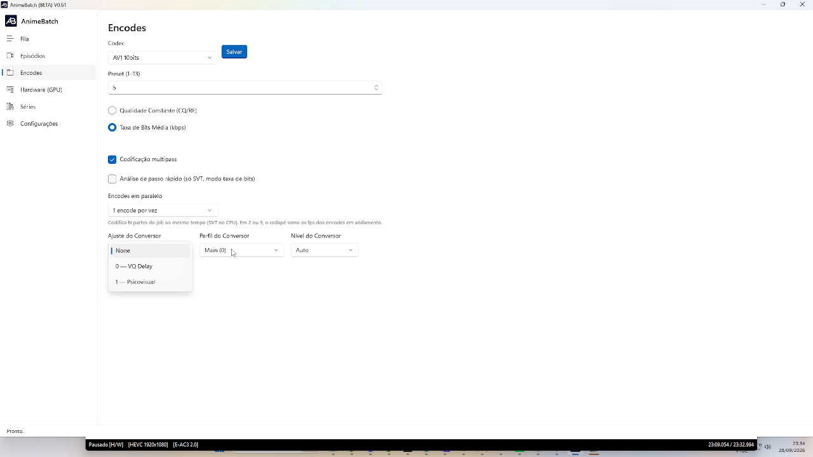

# 4. Encodes

*[← Anterior: Episódios](03-episodios.md) · [Índice](README.md) · [Próxima: Hardware →](05-hardware.md)*

---

A aba **Encodes** guarda a configuração padrão de **cada codec** — o que você
define aqui vale para todos os capítulos que não tenham override próprio
(feito no modal de capítulo da tela [Episódios](03-episodios.md)).

Selecione o **Codec** no combo, ajuste os campos e clique em **Salvar** — cada
codec guarda a sua própria configuração.

## Os campos

- **Preset (1–13)** — o esforço do encoder. Números **menores = mais lento e
  melhor qualidade**; maiores = rápido e pior. O padrão do app é **5**. Se um
  capítulo não definir preset próprio, este é o usado para todos.
- **Modo de taxa** — duas alternativas exclusivas:
  - **Qualidade Constante (CQ/RF)**: você fixa um nível de qualidade (ex.: 18)
    e o encoder gasta os bits que precisar. Tamanho final menos previsível.
    Também pode ser definido por capítulo (o campo do modal vira *Quality
    (CQ)*).
  - **Taxa de Bits Média (kbps)**: você fixa o alvo médio — com o aviso de que
    *"usa o kbps configurado em cada capítulo na tela de Episódios"*. É o
    caminho do app: os valores por capítulo/classe da série mandam.
- **Codificação multipass** (2-pass) — a primeira passada **analisa** o vídeo
  e a segunda encodea sabendo onde gastar bits. Resultado bem melhor em
  bitrate baixo; é a configuração preferida do autor (com 1 encode por vez e
  preset 5). No rodapé, só a passada 2 conta como vídeo convertido.
- **Análise de passo rápido** (só SVT, modo taxa de bits) — acelera a passada
  1 de análise. O autor **não gosta** de usar — fica a seu critério.
- **Conversão Rápida** (só NVENC) — zera o lookahead do encoder da GPU para
  uma conversão veloz.
- **Máxima qualidade** — reforço de qualidade (AQ espacial/temporal + tune
  UHQ + filtro temporal): análise estendida, encode mais lento, evita
  macroblocos. Não combina com Conversão Rápida.
- **Encodes em paralelo** (1, 2 ou 3) — quantas **partes** do job encodeiam
  ao mesmo tempo no CPU (SVT). Com 2 ou 3, o rodapé soma os fps dos encodes em
  andamento. Lembrando: cada processo de SVT usa ~2 GB de RAM — em máquinas
  com pouca memória, o próprio app limita os workers internos do AV1an.
- **Detecção de cenas** (motor AV1an) — onde os chunks cortam:
  *Precisa (resolução cheia)*, *Rápida (análise em 720p) — recomendado* ou
  *Máxima velocidade (360p + método rápido)*. As opções só mudam **onde** os
  chunks cortam; parâmetros de vídeo ficam intactos.
- **Ajuste / Perfil / Nível do Conversor** (`tune` / `profile` / `level`):
  - **Ajuste**: SVT tem *None*, *0 — VQ Delay*, *1 — Psicovisual*; NVENC tem
    *None*, *High Quality (hq)*, *Low Latency (ll)*, *Ultra Low Latency
    (ull)*, *Lossless*.
  - **Perfil**: só existe *Main (0)* — todo o app é AV1 4:2:0 (os perfis High
    e Professional são 4:4:4/4:2:2 e o SVT rejeita).
  - **Nível**: *Auto* na prática — não há necessidade de mexer.

## Qual codec escolher? (recomendação do autor)

| Objetivo | Codec |
|----------|-------|
| Menor arquivo com a melhor qualidade (produção) | **AV1 10bits** (SVT, 2-pass) |
| Velocidade máxima, tamanho maior | **AV1 10bits NVENC** |
| Qualidade do SVT com mais velocidade (chunks paralelos) | **AV1an 10bits** |

A regra de casa do autor: **produção = AV1an/SVT p6 @ taxa média**, deixando
NVENC para quando o tempo manda.

---

*[← Anterior: Episódios](03-episodios.md) · [Índice](README.md) · [Próxima: Hardware →](05-hardware.md)*
